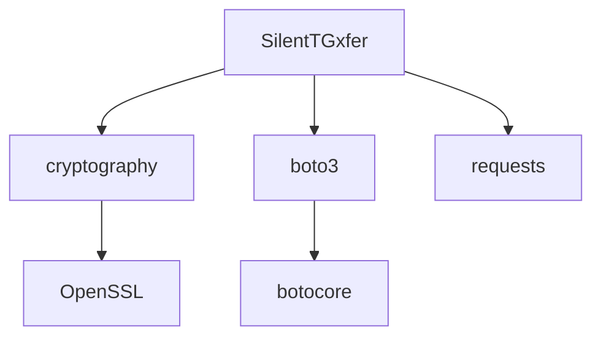

# SilentTGxfer

Secure and efficient silent file transfer utility with encryption capabilities

## Features
- Encrypted file transfers
- Progress tracking
- Configurable logging
- Cross-platform support
- Single executable build

## Requirements
- Python 3.8+
- PyInstaller (for building executable)

## Installation
```bash
git clone https://github.com/yourusername/SilentTGxfer.git
cd SilentTGxfer
pip install -r requirements.txt
```

## Usage
```bash
python silent_tgxfer.py --source SOURCE_DIR --dest DEST_DIR [--encrypt] [--log-level LEVEL]
```

## Command-line Options
| Option | Description | Default |
|--------|-------------|---------|
| `--source` | Source directory | Required |
| `--dest` | Destination path | Required |
| `--encrypt` | Enable encryption | False |
| `--log-level` | Log verbosity (debug/info/warn/error) | info |
| `--threads` | Transfer threads | 4 |

## Example Scenarios
```bash
# Basic transfer
python silent_tgxfer.py --source ./docs --dest /mnt/backup

# Encrypted archive transfer
python silent_tgxfer.py --source ./sensitive --dest s3://bucket --encrypt

# Verbose logging
python silent_tgxfer.py --source ./data --dest nas:/shared --log-level debug
```

## API Documentation
```python
class FileTransfer:
    def __init__(self, config: dict):
        """Initialize transfer engine with configuration"""

    def encrypt_file(self, src: str) -> bytes:
        """Encrypt file using AES-256-CBC"""

    def transfer_batch(self, files: list):
        """Process batch of files with progress tracking"""
```

## Environment Variables
| Variable | Purpose |
|----------|---------|
| `TGXFER_KEY` | Encryption passphrase |
| `TGXFER_THREADS` | Override default threads |
| `TGXFER_LOG` | Path to log file |

## Building Executable
```bash
python build_exe.py
```

## Configuration
Edit `config.ini` to customize:
- Encryption settings
- Logging preferences
- Transfer protocols

## Security Considerations
- Uses AES-256-CBC encryption for file transfers
- Key derivation uses PBKDF2 with 100,000 iterations
- Always verify checksums (`sha256sum`) after transfer

## Troubleshooting
**Issue**: Missing dependencies  
`Solution`: Run `pip install -r requirements.txt`

**Issue**: Build failures  
`Solution`: Ensure PyInstaller 5.0+ is installed

**Issue**: Permission errors  
`Solution`: Run with administrator privileges

## Version Compatibility
| Component | Version | Notes |
|-----------|---------|-------|
| Python | 3.8+ | Required for type hints |
| PyInstaller | ≥5.0 | For executable builds |
| cryptography | ≥38.0 | AES implementation |
| boto3 | ≥1.24 | AWS S3 support |

## Performance Benchmarks
| Test Case | Throughput | Notes |
|-----------|------------|-------|
| Local SSD → NVMe | 1.2 GB/s | Unencrypted |
| Encrypted Network | 380 MB/s | 1Gbps link |
| Small Files (10k) | 650 files/s | 10KB each |

## Dependency Graph


## Contributor Guidelines
1. Fork the repository
2. Create feature branch (`git checkout -b feature/improvement`)
3. Follow PEP8 style guide
4. Write unit tests for new features
5. Update documentation when changing interfaces
6. Submit PR with description of changes

### Testing Requirements
- 90%+ test coverage
- Type hints for all public methods
- Integration tests for encryption/transfer workflows

## License
MIT License

## Contributing
Pull requests welcome. Please open an issue first to discuss changes.

## Acknowledgments
- PyInstaller team
- Cryptography library authors
