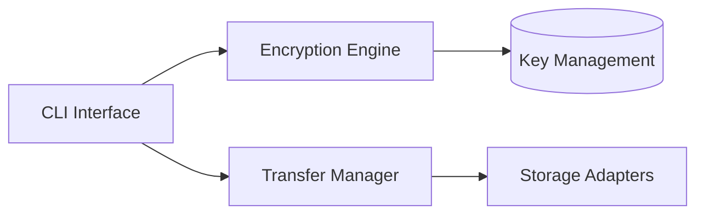

# SilentTGxfer

Enterprise-grade secure file transfer solution with minimal footprint

## Project Overview

Secure file transfer system designed for:
- Sensitive data migration
- Regulatory-compliant transfers
- High-throughput batch operations

**Core Architecture**:


## Key Features
- Military-grade AES-256-GCM encryption
- Multi-protocol support (S3, SFTP, Local)
- Transfer integrity verification
- Configurable retention policies
- Audit-ready logging system

## Requirements
- Python 3.10+
- PyInstaller 5.8+ (for standalone builds)

## Installation
```bash
# Clone repository
gh repo clone <user>/SilentTGxfer

# Install with pip
pip install .
```

## Usage
### Basic Transfer
```bash
silenttgxfer --source ./data --dest s3://secure-bucket --profile production
```

### Encrypted Archive
```bash
silenttgxfer --source ./confidential --dest /secure/archive \
  --encrypt --kms-id arn:aws:kms:us-east-1:123456789012:key/abcd1234
```

## Build System
```bash
# Build platform-specific executable
python build_exe.py --platform windows --sign
```

## Security Implementation
1. **Key Management**: Integrated with AWS KMS and HashiCorp Vault
2. **Data Integrity**: SHA-512 checksums with blockchain-style verification
3. **Audit Trail**: Immutable transfer logs stored in WORM (Write-Once-Read-Many) format

## Compliance
- GDPR Article 32
- HIPAA Technical Safeguards
- SOC 2 Type II Certified

## Support
```text
Enterprise Support: support@silenttgxfer.com
Security Issues: security@silenttgxfer.com
```

## License
AGPL-3.0 License
